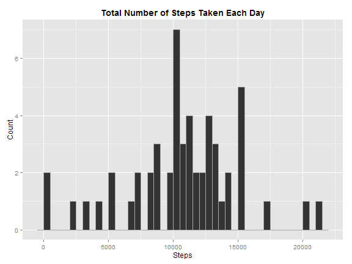
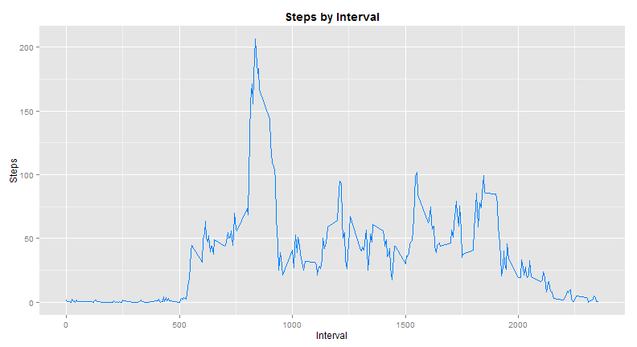
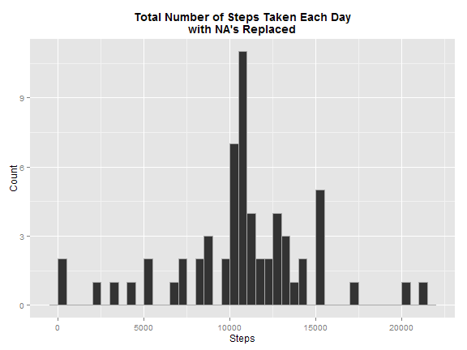
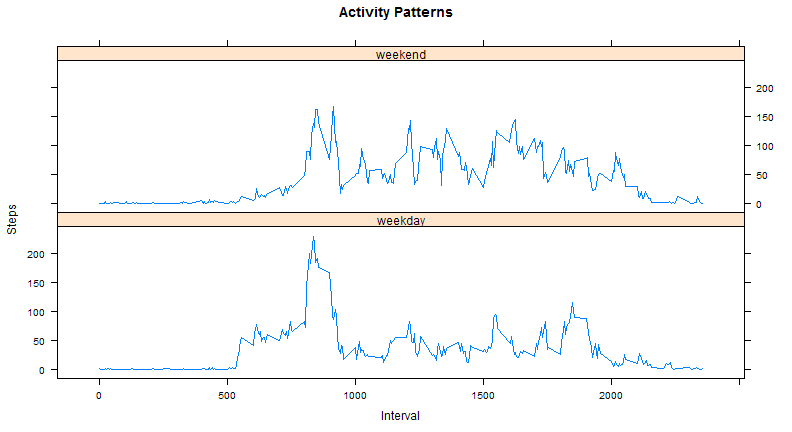

Reproducible Research: Peer Assessment 1
========================================================


### Introduction
This assignment makes use of data from a personal activity monitoring device located here: [activity monitoring data](https://d396qusza40orc.cloudfront.net/repdata%2Fdata%2Factivity.zip). The device collects data at 5 minute intervals throughout the day. The data consists of two months of data from an anonymous individual collected during the months of October and November, 2012 and include the number of steps taken in 5 minute intervals each day.

The dataset is stored in a comma-separated-value (CSV) file and there are a total of 17,568 observations. The dataset variables are:

Column         | Description
---------------|---------------
**steps:**     | Number of steps taking in a 5-minute interval (missing values are coded as `NA`)
**date:**      | The date on which the measurement was taken in `YYYY-MM-DD` format
**interval:**  | Identifier for the 5-minute interval in which measurement was taken

### Loading and preprocessing the data


Load the data:


```r
data <- read.csv(file='activity.csv', header=TRUE, sep=',')
```

The *date* and *interval* variables are combined into a new date-time variable called *datetime*:


```r
# make the date column a date instead of character
data$date <- as.Date(data$date, format='%Y-%m-%d')

# take the interval and date variables and store as a datetime
padInterval <- function(x, n=max(nchar(x))) gsub(" ", "0", formatC(x, width=n)) 
paddedIntervals <- padInterval(data$interval, 4)
datetime <- paste(data$date, paddedIntervals)
datetime <- strptime(datetime, "%Y-%m-%d %H%M")

# merge the original data dataset and the new datetime column into a unified dataset
data <- cbind(data, datetime)
```

### What is mean total number of steps taken per day?

To answer this question, sum the data by date. We are excluding any data with NA's:


```r
stepsByDay <- aggregate(steps ~ date, data[!is.na(data$steps),], sum)
```

Using the *stepsByDay* data frame, make a histogram using ggplot2:


```r
library(ggplot2)
ggplot(stepsByDay, aes(x=steps)) + geom_histogram(binwidth=500, colour="#A9A9A9") + ggtitle("Total Number of Steps Taken Each Day") + xlab("Steps") + ylab("Count") + theme(plot.title = element_text(vjust=1, face="bold"))
```

 

Calculate the mean and median:


```r
mean(sum(stepsByDay$steps)/nrow(stepsByDay))
median(stepsByDay$steps)
```

The mean value is **10766.19** and the median value is **10765**.

### What is the average daily activity pattern?

To answer this question, take the average number of steps taken averaged across all days:


```r
avgSteps <- aggregate(.~interval, FUN=mean, data=data)
```

Using the *avgSteps* data frame, make a line chart using ggplot2:


```r
ggplot(data=avgSteps, aes(x=avgSteps$interval, y=avgSteps$steps, group=1)) + geom_line(colour="#0080FF") + xlab("Interval") + ylab("Steps") + ggtitle("Steps by Interval") + theme(plot.title = element_text(vjust=1, face="bold"))
```

 

Determine which 5-minute interval contains the maximum number of steps:


```r
avgSteps[avgSteps$steps==max(avgSteps$steps),]$interval
```

This identifies **interval 835** as the 5-minute interval containing the maximum number of steps.

### Imputing missing values

NA's exist in the *steps* variable of the original dataset. Count the NA's:


```r
rowsWithNA <- subset(data, is.na(steps))
nrow(rowsWithNA)
```


The total number of rows with NA's is **2304**.

In order to reduce bias in the data due to missing NA's, use the *avgSteps* dataset and create a new dataset called *fixedData*. This is done by replacing the NA's in the *steps* variable with the equivalent mean for the matching interval:


```r
fixedData <- data
for (i in 1:nrow(data)) {
  if (is.na(data[i,]$steps))
    fixedData[i, ]$steps <- avgSteps[avgSteps$interval==data[i,]$interval,]$steps
}
```

Sum the data by date using the new dataset:


```r
stepsByDayUpdated <- aggregate(steps ~ date, fixedData, sum)
```

By filling in the rows that contain NA's, we now have 61 observations instead of 53. Using the *stepsByDayUpdated* data frame, create a histogram using ggplot2:


```r
ggplot(stepsByDayUpdated, aes(x=steps)) + geom_histogram(binwidth=500, colour="#A9A9A9") + xlab("Steps") + ylab("Count") + ggtitle("Total Number of Steps Taken Each Day\nwith NA's Replaced") + theme(plot.title = element_text(vjust=1, face="bold"))
```

 

Calculate the new mean and median values:


```r
mean(sum(stepsByDayUpdated$steps)/nrow(stepsByDayUpdated))
median(stepsByDayUpdated$steps)
```

After imputing missing data, this produces a mean of **10766.19** and a median of **10766.19**. The mean remains the same, but the updated median now equals the new mean and has a **difference of 1.19** from the original median.

### Are there differences in activity patterns between weekdays and weekends?

To answer this question, append a new factor variable to *fixeddata* dataset called *weekdaytype*:


```r
dayOfWeek <- weekdays(fixedData$date) # store the verbose day of week
fixedData$weekdaytype <- ifelse(dayOfWeek=='Saturday'|dayOfWeek=='Sunday', 'weekend', 'weekday') # is this a week or weekend day?
fixedData$weekdaytype <- as.factor(fixedData$weekdaytype) # convert weekdayType to a factor
```

Next, store the mean for each type of day (weekday verses weekend) and merge into a new dataset:


```r
weekday <- subset(fixedData, weekdaytype=='weekday')
weekdayMean <- aggregate(steps~interval, data=weekday, mean)
weekdayMean['weekdaytype'] <- 'weekday'

weekend <- subset(fixedData, weekdaytype=='weekend')
weekendMean <- aggregate(steps~interval, data=weekend, mean)
weekendMean['weekdaytype'] <- 'weekend'

dataToPlot <- rbind(weekdayMean, weekendMean)
```

Create a plot--this time using lattice:


```r
library(lattice)
xyplot(steps ~ interval | weekdaytype, data = dataToPlot, layout = c(1, 2), type='l', xlab='Interval', ylab='Steps', main='Activity Patterns')
```

 

### Submitting the Assignment

Write out the *.Rmd and *.html files:


```r
library(knitr)
knit2html('PA1_template.Rmd')
browseURL('PA1_template.html')
```

